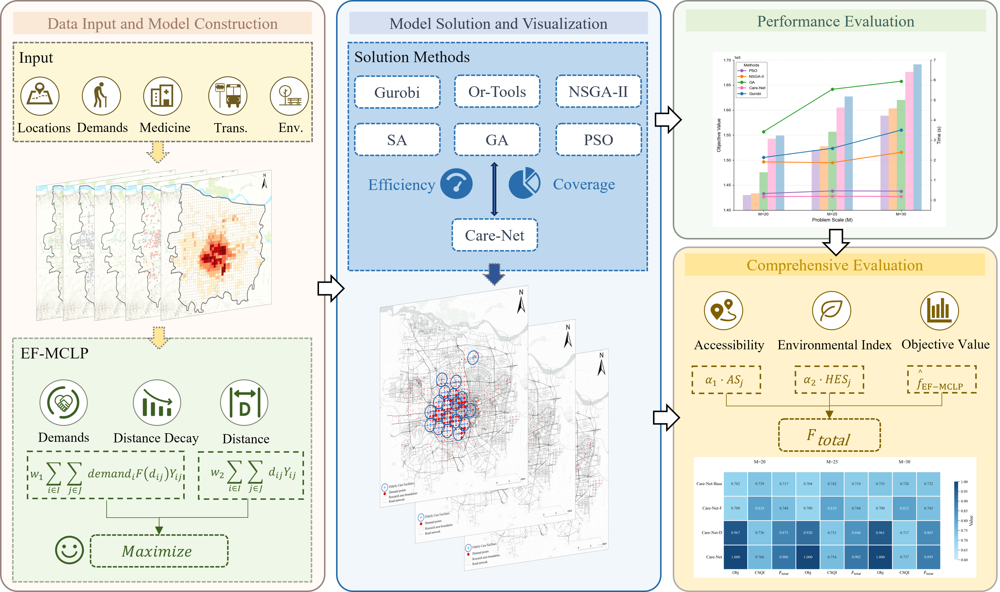
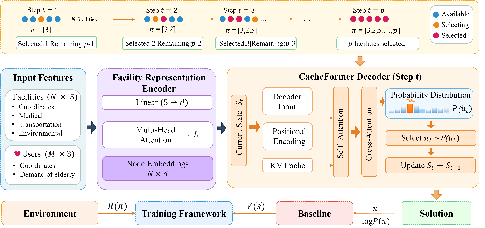
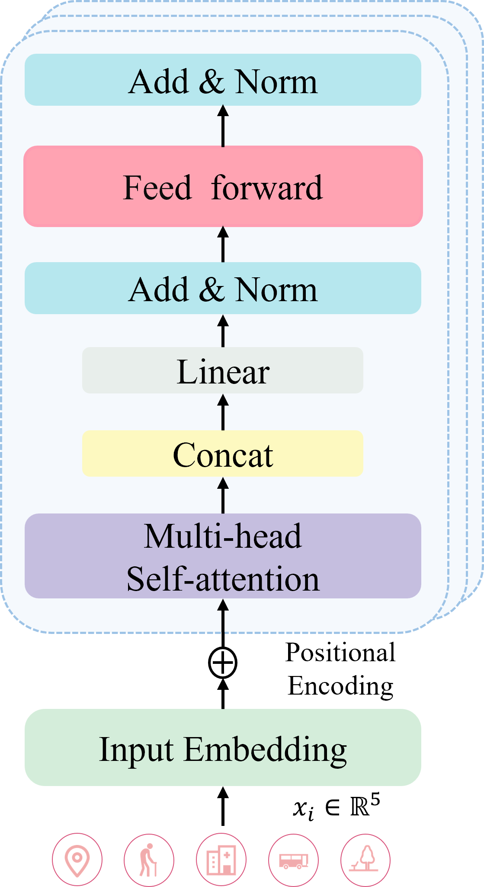
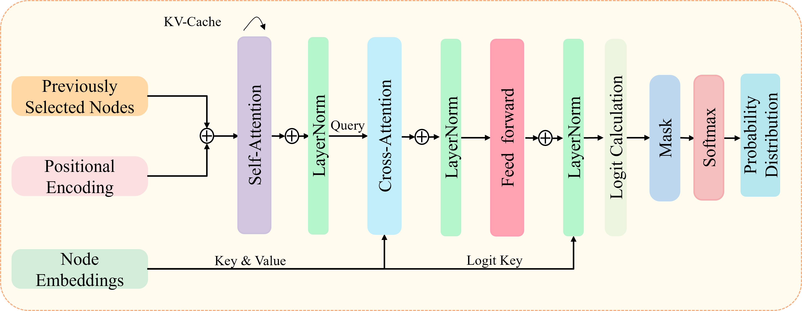
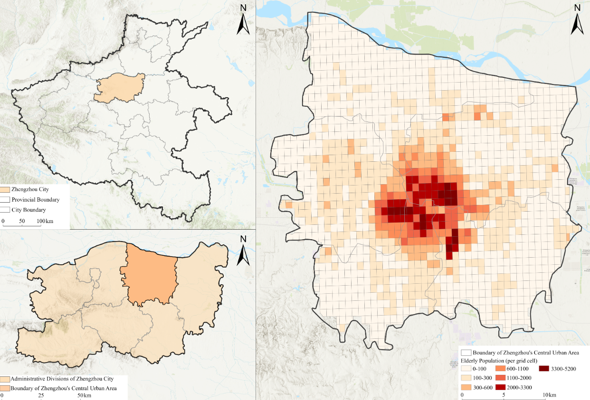
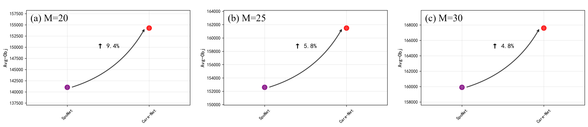
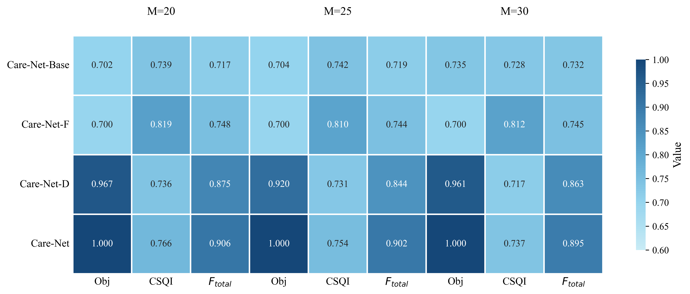

<div align="center">

# Care-Net: Coverage and Allocation with Reinforcement Learning for Human-Centric Elderly Facility Location Optimization

**Care-Net: Coverage and Allocation with Reinforcement Learning for Human-Centric Elderly Facility Location Optimization**  

[](https://www.python.org/)  
[]()  
[]()  

</div>

---

This repository implements **Care-Net**, Coverage and Allocation with Reinforcement Learning for Human-Centric Elderly Facility Location Optimization.  
It combines a **CacheFormer-based encoder** with a **task-specific decoder** to learn facility layouts that jointly optimize **coverage performance** and **equity** given demand points and candidate facilities.
🎉 Our paper has been accepted by Geo-Spatial Information Science! You can read it [here](xxxxx).
---

## 1. Overall Workflow 

The end-to-end workflow is illustrated below:

<div align="center">
  
</div>

**Main stages**:

1. **Data preparation**
   - Load demand points and candidate facilities from `data/`.
   - Normalize coordinates, demands, and construct coverage masks.
2. **Problem formulation**
   - Model the location problem as a sequential decision-making **RL environment** (`problems/MCLP`).
   - The state encodes selected facilities, remaining candidates, and coverage relations.
3. **Model inference / training**
   - Encode facilities and demands using `nets/CacheFormer.py` and `nets/FacilitiesRepresentationEncoder.py`.
   - The decoder iteratively selects the next facility to build a feasible solution.
4. **Evaluation & visualization**
   - Use `train.py` / `run.py` for training and validation.
   - Use the GUI (`gui.py`) or Jupyter notebooks (`jupyter/`) for visual analysis and comparison.

---

## 2. Code Architecture

<div align="center">
  
</div>

The high-level architecture in the figure corresponds to the following code structure:

```text
Care-Net/
  ├─ Algorithm/                 # Classical heuristics (GA / SA / PSO / INSGA-II, etc.)
  ├─ nets/                      # Deep models and baselines
  │   ├─ CacheFormer.py         # Core Care-Net attention / CacheFormer model
  │   ├─ FacilitiesRepresentationEncoder.py
  │   └─ reinforce_baselines.py # Rollout / warmup baselines
  ├─ problems/
  │   └─ MCLP/                  # MCLP environment and state transitions
  ├─ utils/                     # Utility functions, logging, data helpers
  ├─ data/                      # Demand and candidate facility data
  ├─ outputs/                   # Saved models and configs (args.json, epoch-*.pt)
  ├─ jupyter/                   # Experiment and visualization notebooks
  ├─ gui.py                     # Graphical user interface
  ├─ run.py                     # Training / evaluation entry point
  ├─ train.py                   # Single-epoch training logic
  ├─ requirements.txt           # Python dependencies
  └─ Image/                     # Workflow / architecture / structure / results
```

**Key features**:

- **Unified problem interface**: `problems/` encapsulates the MCLP environment, making it easy to extend to other location problems.  
- **Multiple solver families**: `Algorithm/` contains GA / SA / PSO / INSGA-II implementations for comparison against Care-Net.  
- **Modular network design**: Encoders and decoders are decoupled, enabling plug-and-play architecture changes and ablation studies.  

---

## 3. Encoder: Representation Learning for Facilities and Demands

<div align="center">
  
</div>

The encoder is mainly implemented in `nets/FacilitiesRepresentationEncoder.py` and related components in `nets/CacheFormer.py`:

- **Inputs**
  - Demand features: spatial coordinates, demand/population, service radius masks, etc.
  - Candidate facility features: locations, capacity, cost, and other attributes.
- **Objectives**
  - Learn **high-dimensional representations** for demands and facilities.
  - Capture spatial structure and coverage relations for downstream decision making.
- **Implementation highlights**
  - Use **attention / cache mechanisms** to aggregate information across facilities and demands.
  - Design masks and scaling strategies to handle problems of varying sizes (numbers of demands and candidates).

You can inspect and modify `nets/FacilitiesRepresentationEncoder.py` directly to adjust the architecture or add new features.

---

## 4. Decoder: Care-Net Decision Process

<div align="center">
  
</div>

The decoder logic is implemented jointly in `nets/CacheFormer.py` and `nets/reinforce_baselines.py`:

- **Decision process**
  - At each time step, the decoder selects the next facility from the remaining candidates.
  - The process continues until a predefined budget \(p\) is reached or a stopping condition holds.
- **Training scheme**
  - Optimized end-to-end using **policy gradient / REINFORCE**.
  - Stabilized via `RolloutBaseline` and `WarmupBaseline`.
- **Reward design (typical)**
  - Total covered population / demand.
  - Equity of coverage across regions.
  - Penalties for constraint violations (e.g., exceeding budget, distance constraints).

The sampling vs. greedy behaviour is controlled via `set_decode_type(model, ...)` (see `train.py`),
allowing easy switching between **training (sampling)** and **evaluation/inference (greedy)** modes.

---

## 5. Case Study Area & GUI

<div align="center">
  
</div>

The repository provides example datasets and an interactive GUI:

- **Data**
  - `data/Demand-1312/`: 1,312 demand points with corresponding candidate facilities.
  - `data/Deamnd-10000/`: a larger case with 10k demand points.
  - `data/OD.csv`: optional OD / distance information.
- **GUI (`gui.py`)**
  - Parameter panel to select dataset and algorithm (Care-Net / GA / SA / PSO, etc.).
  - One-click run and visualization of facility layouts and coverage.
  - Suitable for **teaching demos, group presentations, and interactive experiments**.

Launch the GUI from a terminal:

```bash
python gui.py
```

(Ensure that the required plotting and GUI libraries are installed on your system.)

---

## 6. Results

<div align="center">
  
  
  
</div>

- **Multi-method comparison**
  - Compare GA / SA / PSO / INSGA-II and Care-Net in terms of **coverage** and **equity**.
  - Visualize solutions for all methods on the same case study.
- **Scalability**
  - Experiments from medium-scale (thousands of demand points) to larger-scale (tens of thousands) scenarios.
- **Reproducible experiments**
  - Trained models and configurations are stored under `outputs/` (e.g., `Care-Net-100-20/epoch-499.pt`, `args.json`).
  - These can be directly reused to reproduce curves and figures.

---

## 7. Environment & Dependencies

### 7.1 Python & Core Dependencies

We recommend **Python 3.8+** and using a dedicated virtual environment:

```bash
# Create and activate an environment (example using conda)
conda create -n care-net python=3.8
conda activate care-net

# Install core dependencies
pip install -r requirements.txt
```

Current `requirements.txt` includes:

- `matplotlib`
- `numpy`
- `pandas`
- `Pillow`
- `cairosvg`

### 7.2 Deep Learning & Logging

Install PyTorch according to your GPU / CUDA environment, for example:

```bash
# Example: please choose the version/CUDA according to the official PyTorch instructions
pip install torch torchvision torchaudio --index-url https://download.pytorch.org/whl/cu118

# Logging and progress bar
pip install tensorboard_logger tqdm
```

For richer geo-visualization, you may additionally install:

```bash
pip install geopandas shapely fiona
```

> On Windows, if installing `geopandas` is problematic, try: `conda install -c conda-forge geopandas`.

---

## 8. Data Preparation

Example data layout:

```text
data/
  ├─ Demand-1312/
  │   ├─ Demand-1312.shp  # demand points (with population / weight attributes)
  │   ├─ Candidate.csv    # candidate facility coordinates / attributes
  │   └─ ...
  ├─ Deamnd-10000/
  │   ├─ demand_points_10000.shp
  │   ├─ Candidate.csv
  │   └─ ...
  └─ OD.csv               # optional OD / distance information
```

**Custom datasets** are recommended to follow:

- Demand layer: coordinates (e.g., `X/Y`) and demand/population fields.
- Candidate table: coordinates and optional capacity/cost fields.
- A consistent coordinate system for meaningful distance calculations.
- If needed, adapt the loading logic in `utils/data_utils.py` and `problems/MCLP/problem_MCLP.py`.

---

## 9. Quick Start

### 9.1 Training Care-Net (Deep RL)

1. **Train the model**

   ```bash
   python run.py \
     --problem MCLP \
     --n_users 1312 \
     --n_facilities 100 \
     --p 20 \
     --r 5.0 \
     --n_epochs 500 \
     --batch_size 512
   ```

   The above is just an example; see `options.py` for tunable hyperparameters such as `embedding_dim`, `hidden_dim`, and `train_decode_strategy`.

2. **Validation / evaluation**

   ```bash
   python run.py --eval_only --load_path outputs/DemandPoint_1312/Care-Net-100-20/epoch-499.pt
   ```

3. **Visualization**

   - Use `gui.py` to visualize solutions interactively.
   - Or open notebooks under `jupyter/` and load results from `outputs/` for in-depth analysis.

### 9.2 Classical Solver Baselines (GA / SA / PSO / INSGA-II)

- Implementations are located in `Algorithm/` and in the corresponding Jupyter notebooks.
- In the notebooks you can:
  - Load the same dataset and parameters.
  - Run the corresponding heuristic solver.
  - Compare solutions on the map against Care-Net.

---

## 10. Reproducibility & Extensions

- **Reproducible configurations**
  - Each training run saves full arguments in `outputs/.../args.json` for exact reproduction.
- **Architecture ablations**
  - Modify the number of encoder/decoder layers, attention heads, or cache mechanisms in `nets/CacheFormer.py`.
- **Problem extensions**
  - Copy `problems/MCLP` to a new subdirectory and adjust state and reward definitions to support other location/scheduling problems.
- **Visualization enhancements**
  - Combine `geopandas`, `matplotlib`, or `folium` for publication-ready maps and heatmaps.


## 11. License & Acknowledgements

- This code is intended for academic research and teaching only; data copyrights remain with the original providers.
- Some implementations are inspired by classic RL and location optimization repositories.
- We gratefully acknowledge PyTorch, SciPy, NumPy, Matplotlib, GeoPandas, `tensorboard_logger`, and other open-source tools used in this project.


